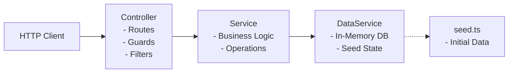

# Backend Architecture Guide - ResourceX

This document describes the design patterns, code structure, and request lifecycle of the ResourceX NestJS backend.

---

## 1. Directory Structure

The backend is structured into domain-driven feature modules. Each module is fully self-contained, enclosing its controllers, services, DTOs, scoped middlewares, and exception filters:

```text
backend/src/
├── app.module.ts                   # Root application module
├── main.ts                         # Application entrypoint
├── common/                         # Shared enums, types, guards, and Swagger models
├── data/                           # In-memory database service and seed state
│   ├── data.module.ts
│   ├── data.service.ts
│   └── seed.ts
├── [module_name]/                  # Feature modules (e.g., users, profile, support)
│   ├── [module].module.ts          # Dependency injection container wiring
│   ├── [module].controller.ts      # HTTP route mappings & role definitions
│   ├── [module].service.ts         # Business logic layer
│   ├── dto/                        # Data Transfer Objects for validation
│   ├── filters/                    # Module-scoped custom exception filters
│   └── middleware/                 # Scoped logging, security, rate limit, and validation
```

---

## 2. Component Design Patterns

ResourceX follows a layered, modular architecture based on the **Controller-Service-Repository** pattern:



### Controllers
Handle HTTP routing, request parsing, Swagger documentation mappings, and route-level authorization guards (e.g. `@Roles()`). Controllers are kept slim and delegate execution straight to services.

### Services
Contain the core business logic, validation logic, permission checks, state changes, and updates. Services are stateless and inject dependencies via constructor injection.

### In-Memory Persistence Layer (`DataService`)
Instead of a physical database, the backend uses `DataService` (located in `src/data/data.service.ts`) as an in-memory runtime store.
* The database state is loaded from a static `seedState` object at application boot.
* Direct mutations are made against this in-memory collection during runtime.
* The mock DB can be programmatically reset back to the seed state via `dataService.reset()` (useful for test runs).

---

## 3. Request Execution Lifecycle

When an HTTP request is made to the backend, it passes through the following pipeline:

```mermaid
graph TD
    Client[Client Request] --> Prefix[/api Prefix]
    
    subgraph Middlewares [Module Middleware Chain]
        Prefix --> Log[Logging Middleware]
        Log --> Sec[Security Headers Middleware]
        Sec --> Rate[Rate Limiter Middleware]
        Rate --> Val[Validation Middleware]
    end
    
    subgraph Guards [NestJS Guards]
        Val --> Auth[AuthGuard - JWT Verification]
        Auth --> Roles[RolesGuard - RBAC Check]
    end
    
    subgraph Execution [Route Execution]
        Roles --> ControllerHandler[Controller Route Handler]
        ControllerHandler --> ServiceMethod[Service Business Logic]
        ServiceMethod --> InMemDb[(In-Memory Database)]
    end
    
    ControllerHandler -->|Throws Exception| ExceptionFilter[Exception Filter]
    ServiceMethod -->|Throws Exception| ExceptionFilter
    ExceptionFilter -->|Log stack trace| FileLogger[(Module Scoped log file)]
    ExceptionFilter -->|Return standardized JSON| JSONResponse[JSON Error Response]
```

1. **Route Prefix Routing**: The request hits `/api/` and routes toward the appropriate Controller module.
2. **Module Middleware Chain**: The request passes through the local middleware pipeline configured for the module:
   * **Logging**: Records access metadata and execution duration.
   * **Security Headers**: Sets client response security constraints.
   * **Rate Limiter**: Checks window access counts per user/IP.
   * **Validation Middleware**: Validates URL parameter formats and body constraints.
3. **Guard Verification**: NestJS resolves route guard claims:
   * `AuthGuard`: Verifies JWT bearer tokens and sets `req.context` details.
   * `RolesGuard`: Verifies Role access claims (RBAC) against requested endpoints.
4. **Execution**: The Controller handler executes and calls the corresponding Service method.
5. **Exception Filter Catching**: If an error is raised at any stage (pipes, controller, service), it is intercepted by the module-scoped `ExceptionFilter`. The filter logs the error context (with full stack trace for 500 crashes) to `logs/[module]-error.log` and returns a standard formatted JSON error payload to the client.

---

## 4. Authentication & Authorization

### JWT Authentication (`AuthGuard`)
All routes (except those decorated with `@Public()`) require a valid JSON Web Token:
1. The client logs in via `POST /api/auth/login` to receive an `access_token` containing user metadata (`userId`, `role`, `organizationId`).
2. Subsequent requests must carry this token in the header: `Authorization: Bearer <token>`.
3. The global `AuthGuard` extracts, verifies, and decrypts the token, attaching the user context (`userId`, `role`, `organizationId`) directly to the request object as `req.context`.

### Role-Based Access Control (`RolesGuard`)
Routes can restrict access to specific roles using the `@Roles(...)` decorator:
1. The global `RolesGuard` matches the user's role from `req.context.role` against the list of permitted roles on the controller or route handler.
2. If the user's role does not match, a `403 Forbidden` exception is thrown.

---

## 5. Module-Scoped Middleware Architecture

To enforce clean decoupling and prevent shared module dependencies, feature modules implement local middleware pipelines. Below is the blueprint of what each middleware file contains and represents:

### 1. File Logger Service (`[module]-file-logger.ts`)
* **Service Class**: `[Module]FileLoggerService` (e.g. `UsersFileLoggerService`)
* **Responsibility**: Manages file-system logging for the module.
* **Mechanism**: 
  * Writes log lines asynchronously to `logs/[module]-access.log` and `logs/[module]-error.log`.
  * Avoids in-memory buffering to ensure no log logs are lost if the Node process crashes.
  * Implements daily date rotation logic: when a request is made on a new calendar day, the service renames yesterday's logs to `*-YYYY-MM-DD.log` and starts fresh files.

### 2. Logging Middleware (`[module]-logging.middleware.ts`)
* **Middleware Class**: `[Module]LoggingMiddleware` (e.g. `UsersLoggingMiddleware`)
* **Responsibility**: Tracks incoming traffic to endpoints.
* **Mechanism**:
  * Listens to the response `'finish'` event.
  * Calculates request duration in milliseconds.
  * Extracted from the request context: acting role and user ID.
  * Format: `[timestamp] | [HTTP method] | [path] | [status] | [duration] | role=[role] | user=[userId]`.
  * Logs to Nest's console and writes the entry to the module's `*-access.log` file.

### 3. Security Middlewares (`[module]-security.middleware.ts`)
This file contains two distinct middlewares:
* **Headers Middleware Class**: `[Module]SecurityHeadersMiddleware` (e.g. `UsersSecurityHeadersMiddleware`)
  * Sets security parameters on every response header (e.g. `X-Frame-Options: DENY`, `X-Content-Type-Options: nosniff`, and custom `Content-Security-Policy`).
* **Rate-Limit Middleware Class**: `[Module]RateLimitMiddleware` (e.g. `UsersRateLimitMiddleware`)
  * Tracks request counts per authorization token (or client IP address for public routes) inside a sliding 60-second window.
  * Rejects requests exceeding limits (typically 30 or 60 requests/min) with a `429 Too Many Requests` error and logs the violation to the module's `*-error.log`.

### 4. Validation Middleware (`[module]-validation.middleware.ts`)
* **Middleware Class**: `[Module]ValidationMiddleware` (e.g. `UsersValidationMiddleware`)
* **Responsibility**: Inspects request payloads before Nest routes them to a controller handler.
* **Mechanism**:
  * Extracts route parameters (like IDs) from the raw URL path since Nest `req.params` is empty at the middleware stage.
  * Validates string limits, types, and DTO constraints (e.g. email patterns, password lengths).
  * **Critical Logging**: Injects `[Module]FileLoggerService`. If validation fails, it records the exact warning parameters to `logs/[module]-error.log` first, then raises a `BadRequestException` (400) to abort execution.

---

## 6. Isolated Logging & Exception Filters

* **Scoped Exception Filters**: Each module controller class is decorated with `@UseFilters(ExceptionFilter)`. This intercepts route exceptions, logs detailed traces (including stack traces for 500 errors) to the module's error log, and returns a standard JSON payload format to the client.
* **Scoped File Logger Services**: Daily rotated file loggers write entries directly to individual files inside the `logs/` directory (e.g. `logs/users-access.log`, `logs/users-error.log`). Rejections occurring inside pre-routing validation middlewares are self-logged here.
